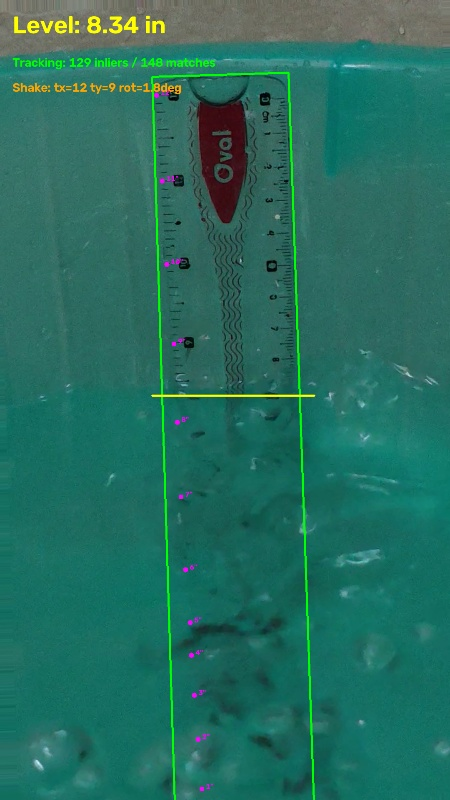

# Robust Water Level Measurement via Computer Vision

This repository implements a robust, real-time computer vision pipeline to measure the water level inside a container using a submerged scale (ruler) and a fixed camera. 

The system uses **Feature-Based Tracking (ORB + Homography)** to compensate for real-world camera shake/vibration and **Edge Density Analysis** to accurately detect the water level line.



## Core Features

- **Dynamic Tracking**: Automatically tracks the ruler even if the camera translates or rotates, preventing measurement drift.
- **Water Level Detection**: Bottom-up edge density scan robustly identifies the transition from submerged (blurred) to dry (sharp) markings.
- **Perspective Warping**: Converts pixel-level detections into physical measurements (inches) using a non-linear mapping defined during calibration.
- **Interactive Inspection**: Built-in tools to inspect the pipeline frame-by-frame and test against artificial shake.

## Architecture

1. **Calibration (`calibrate.py`)**: A one-time interactive script where the user defines a bounding box around the scale and marks known physical points (0-12 inches).
2. **Feature Setup**: Extracts ORB keypoints from the reference frame to serve as the visual fingerprint of the scale.
3. **Per-Frame Tracking**: Matches ORB keypoints in new frames to the reference keypoints, computing a homography matrix to warp the bounding box and measurement coordinates.
4. **Edge Density Scan**: Uses Canny edge detection and vertical smoothing to find the highest sharp edge on the scale.
5. **Measurement (`measure_water.py`)**: Applies a moving average over the readings and interpolates the physical water level, generating an annotated output video.

## Installation

```bash
# Clone the repository
git clone https://github.com/yourusername/water-level-measurement.git
cd water-level-measurement

# Create a virtual environment
python -m venv venv
# Activate it (Windows)
.\venv\Scripts\activate
# Activate it (Unix)
# source venv/bin/activate

# Install dependencies
pip install opencv-python numpy
```

## Usage

1. **Prepare Data**: Ensure your extracted frames are in `Data/Extracted_Frames/`.
2. **Calibrate**:
   ```bash
   python calibrate.py
   ```
   Follow the on-screen instructions to draw the bounding box and select the 13 measurement points.
3. **Inspect (Optional)**:
   ```bash
   python inspect_frame.py
   ```
   Type a frame number to view the pipeline. Add an `s` (e.g., `50s`) to test with artificial camera shake.
4. **Measure**:
   ```bash
   python measure_water.py
   ```
   This processes the entire sequence and outputs `output_measurement.mp4`.

## Testing

The system includes an artificial shake utility (`apply_shake` in `core.py`) that applies random translation and rotation to frames to simulate realistic wind-induced vibration. The ORB tracker successfully recovers the scale's position and maintains measurement accuracy under these conditions.

See `Report.md` (or the PDF version) for a detailed technical breakdown of the pipeline and performance.
