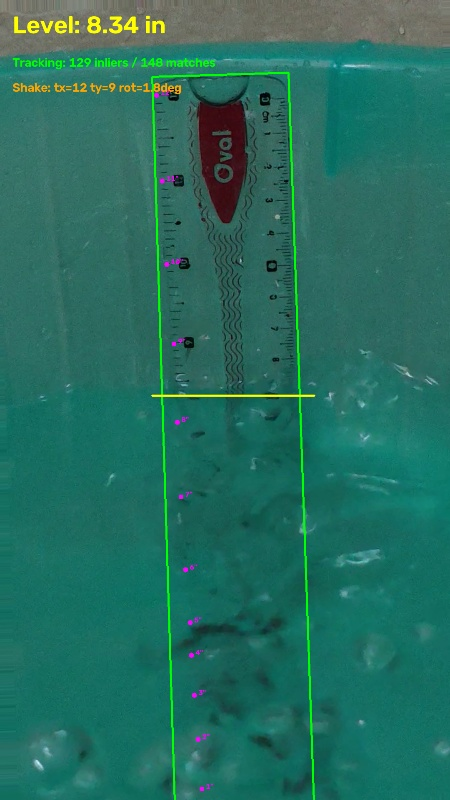

# Robust Water Level Measurement via Computer Vision

Real-time computer vision pipeline to measure water level inside a container using a submerged ruler and a fixed camera. Supports standard and simulated night-vision (IR) camera modes.

The system uses **Feature-Based Tracking (ORB + Homography)** to compensate for camera shake/vibration and **Edge Density Analysis** to detect the water surface line.



## Core Features

- **Dynamic Tracking**: Tracks the ruler across translation, rotation, and perspective shift via ORB + RANSAC homography.
- **Water Level Detection**: Bottom-up edge density scan identifies the dry/submerged transition on the ruler.
- **Night-Vision Mode**: Simulates an IR security camera feed (grayscale, sensor noise, IR illuminator hotspot) with automatically tuned edge scan parameters.
- **Mixed Mode**: First half of the sequence runs as normal camera, second half switches to NV — useful for transition testing.
- **Perspective Mapping**: Pixel-level detections interpolated against 13 calibrated inch marks for a physical measurement.
- **Interactive Inspection**: Per-frame debugger and NV preview player for parameter tuning.

## File Overview

| File | Purpose |
|---|---|
| `extract_frames.py` | One-time: extract frames from the source video at 2 FPS |
| `calibrate.py` | One-time interactive GUI: define ruler bbox + 13 inch marks |
| `config.json` | Calibration output (ruler bbox + pixel↔inch reference points) |
| `core.py` | All pipeline logic: `setup_reference`, `track_ruler`, `calculate_water_y`, `get_water_level`, `apply_shake` |
| `run.py` | **Main entry point** — runs the pipeline in normal / nv / mixed mode |
| `simulate_nightvision.py` | NV filter (tunable parameters at the top) + `simulate_nv()` |

## Installation

```bash
# Clone the repository
git clone https://github.com/yourusername/water-level-measurement.git
cd water-level-measurement

# Create a virtual environment
python -m venv venv
# Activate (Windows)
.\venv\Scripts\activate
# Activate (Unix)
# source venv/bin/activate

# Install dependencies
pip install opencv-python numpy matplotlib
```

## Usage

### 1. Prepare data
Place your source video at `Data/VID_20260924_174810.mp4` and extract frames:
```bash
python extract_frames.py
```

### 2. Calibrate (one-time)
```bash
python calibrate.py
```
Draw a bounding box around the ruler and click the 13 inch marks (0–12 in). Saves `config.json`.

### 3. Run the pipeline

```bash
# Standard camera
python run.py --mode normal

# Simulated night-vision camera
python run.py --mode nv

# Mixed: first half normal, second half NV (transition test)
python run.py --mode mixed

# Disable artificial shake
python run.py --mode nv --no-shake

# Custom output filename
python run.py --mode mixed --output my_test.mp4
```

Output video is saved as `output_<mode>.mp4` by default.


## Tuning the NV Filter

All NV simulation parameters live at the top of `simulate_nightvision.py`:

| Parameter | Default | Effect |
|---|---|---|
| `NOISE_SIGMA` | 3.0 | Sensor grain — raise for noisier camera |
| `IR_HOTSPOT_STRENGTH` | 0.35 | Centre bloom from IR illuminator ring |
| `IR_HOTSPOT_RADIUS` | 0.55 | How wide the hotspot spreads |
| `GAMMA` | 0.80 | Sensor brightness curve (< 1 brightens midtones) |
| `BLUR_SIGMA` | 1.2 | NIR focus softness |
| `MODE` | `ir_security` | `ir_security` (grey) or `nvg_green` (phosphor tint) |

After adjusting, run `python preview_nv.py` to see the effect live, then `python evaluate_nv.py` to verify measurement accuracy hasn't regressed.

Edge scan parameters for each mode are in `EDGE_PARAMS` at the top of `run.py`.

## Pipeline (per frame)

1. **ORB feature matching** — current frame keypoints matched against reference (Lowe ratio 0.75, min 8 matches)
2. **RANSAC homography** — 3×3 matrix encoding full geometric shift (threshold 5px)
3. **Coordinate warping** — ruler bbox + all 13 inch marks transformed to current frame position
4. **Bottom-up edge density scan** — Canny edges → row-wise density → 50px smoothing → scan upward for water surface
5. **Interpolation** — `np.interp` against warped inch marks → inches
6. **Temporal smoothing** — moving average (window=2) to suppress ripple jitter

See `Report.md` for a full technical breakdown.
